# AJAX、HTML5 和客户端攻击

在第一章中，我们回顾了 AJAX 和 HTML5 的功能和工作原理。在本章中，我们将深入探讨它们的安全方面以及它们如何在 Web 应用程序中引入或扩展漏洞，从而给渗透测试人员带来新的挑战。

如第一章所述，AJAX 是一种组合技术，主要包括 JavaScript、XML 和 Web 服务，它们允许客户端和服务器之间进行异步 HTTP 通信。

# 爬取 AJAX 应用程序

在基于 AJAX 的应用程序中，爬虫可以识别的链接取决于应用程序的逻辑流程。在本节中，我们将讨论三种用于爬取 AJAX 应用程序的工具：

+   AJAX Crawling Tool

+   Sprajax

+   AJAX Spider OWASP ZAP

与任何自动化任务一样，爬取 AJAX 应用程序必须仔细配置、记录和监控，因为它们可能会调用意外的函数并触发应用程序上的不希望的效果，例如影响数据库内容。

# AJAX 爬行工具

**AJAX Crawling Tool**（ACT）用于枚举 AJAX 应用程序。它可以与 Web 应用程序代理集成。爬取后，链接将在代理界面中可见。从那里，您可以测试应用程序的漏洞。要设置和使用 ACT，请按照以下说明操作：

1.  从以下 URL 下载 ACT：

[`code.google.com/p/fuzzops-ng/downloads/list`](https://code.google.com/p/fuzzops-ng/downloads/list)

1.  下载 ACT 后，使用以下命令从 bash shell 启动它：

```
      java -jar act.jar
```

此命令将生成以下截图中显示的输出：


指定目标 URL，并将代理设置为与您的代理链接。

在这种情况下，使用运行在本地主机上端口`8010`的 ZAP 代理。您还需要指定浏览器类型。要开始爬取，请单击 Crawl 菜单，然后选择 Start Crawl 选项。

1.  一旦 ACT 开始“蜘蛛爬行”应用程序，新的链接将在代理窗口中可见，如下面的截图所示：

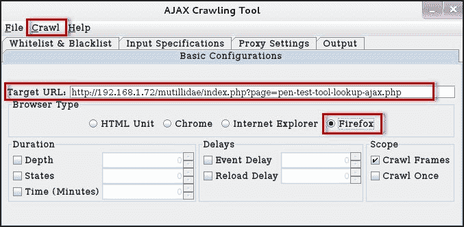

# Sprajax

**Sprajax**是一个专门为使用 AJAX 框架构建的应用程序设计的 Web 应用程序扫描器。它是一个黑盒安全扫描器，这意味着它不需要预先配置目标应用程序的详细信息。它首先识别使用的 AJAX 框架，这有助于它创建具有较少误报的测试用例。Sprajax 还可以识别典型的应用程序漏洞，如 XSS 和 SQL 注入。它首先识别函数，然后通过发送随机值来模糊它们。**模糊**是向目标发送多个探测并分析它们的行为，以便在其中一个探测触发漏洞时检测到的过程。*OWASP Sprajax 项目*的 URL 是[`www.owasp.org/index.php/Category:OWASP_Sprajax_Project`](https://www.owasp.org/index.php/Category:OWASP_Sprajax_Project)。

除了 ACT 和 Sprajax，Burp Suite 代理和 OWASP ZAP 提供了爬取 AJAX 网站的工具，但手动爬取应用程序是侦察过程的重要部分，因为基于 AJAX 的应用程序可能包含许多隐藏的 URL，只有在了解应用程序的逻辑后才会暴露出来。

# AJAX Spider - OWASP ZAP

AJAX Spider 与 OWASP ZAP 集成。它使用一种简单的方法，通过浏览器跟踪所有可以找到的链接，甚至是由客户端代码生成的链接，从而有效地爬取各种应用程序。

可以从攻击菜单中调用 AJAX Spider，如下面的截图所示：


接下来，在 Spider 开始爬行过程之前，有一些参数需要配置。您可以选择插件使用的 Web 浏览器。在选项选项卡中，您还可以定义要打开的浏览器窗口数量、爬行深度和线程数量。在修改这些选项时要小心，因为它可能会减慢爬行速度：

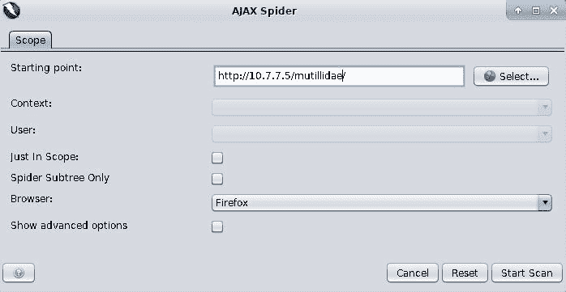

当爬行开始时，会打开一个浏览器窗口，ZAP 将自动浏览应用程序，而结果将在底部窗格的 AJAX Spider 选项卡中显示：


# 分析客户端代码和存储

我们之前已经讨论过客户端代码增加可能导致潜在安全问题的情况。AJAX 使用 XMLHttpRequest（XHR）对象向服务器发送异步请求。这些 XHR 对象是使用客户端 JavaScript 代码实现的。

有几种方法可以了解更多关于客户端代码的信息。通过按下 Ctrl + U 快捷键查看源代码将显示创建 XHR 对象的底层 JavaScript。如果网页和脚本很大，通过查看源代码来分析应用程序将不会有帮助和/或实用。

要了解脚本发送的实际请求，您可以使用 Web 应用程序代理并拦截流量，但请求将在通过客户端脚本代码的一系列过程后到达代理，这些过程可能包括验证、编码、加密和其他修改，这将使您对应用程序的工作原理的理解变得复杂。

在本节中，我们将使用 Web 浏览器的内置开发工具来分析客户端代码的行为以及它对页面上显示的内容和服务器从应用程序接收到的内容的影响。所有主要的现代 Web 浏览器都包含用于调试 Web 应用程序中的客户端代码的工具，尽管有些浏览器可能具有更多的功能。它们都包括以下基本组件：

+   页面元素的对象检查器

+   控制台输出以显示错误、警告和日志消息

+   脚本代码调试器

+   网络监视器以分析请求和响应

+   用于管理 Cookie、缓存和 HTML5 本地存储的存储管理器

大多数浏览器都遵循最初的 Firefox 插件 Firebug 的设计。我们将介绍 Firefox 的 Web 开发工具，因为它是 Kali Linux 中包含的工具。

# 浏览器开发工具

在 Firefox 中，与所有主要浏览器一样，可以使用 F12 键激活开发工具；在 Firefox 中还可以使用其他组合键，例如 Ctrl + C 和 Ctrl + I。下图显示了设置面板，您可以在其中选择要显示的工具以及其他首选项，如颜色主题、可用按钮和键绑定：

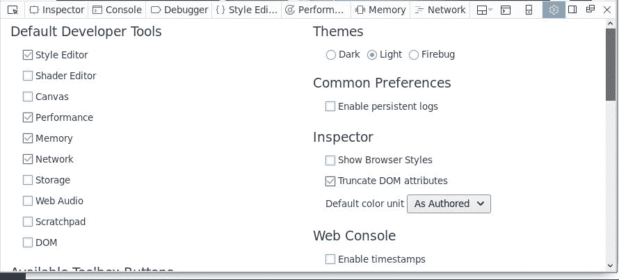

# 检查器面板

检查器面板（如下图所示）显示当前页面中包含的 HTML 元素及其属性和样式设置。您可以更改这些属性和样式，还可以删除或添加元素：

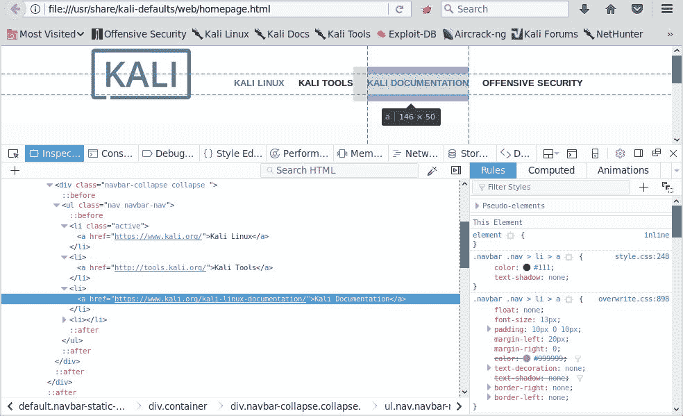

# 调试器面板

调试器面板是您可以深入了解实际 JavaScript 代码的地方。它包括一个调试器，您可以在其中设置断点或逐步执行脚本，同时分析客户端代码的流程并识别出有漏洞的代码。每个脚本都可以通过下拉菜单单独查看。Watch 侧面板将显示脚本执行过程中变量的值。设置的断点在 Breakpoints 面板下可见，如下图所示：

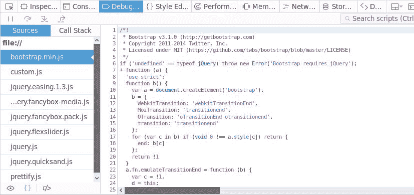

调试器面板的一个最新添加功能是能够以更易读的方式格式化源代码，因为许多 JavaScript 库加载为单行文本。在 Firefox 中，此选项称为 Prettify Source，可以通过右键单击代码并从上下文菜单中选择来激活它：

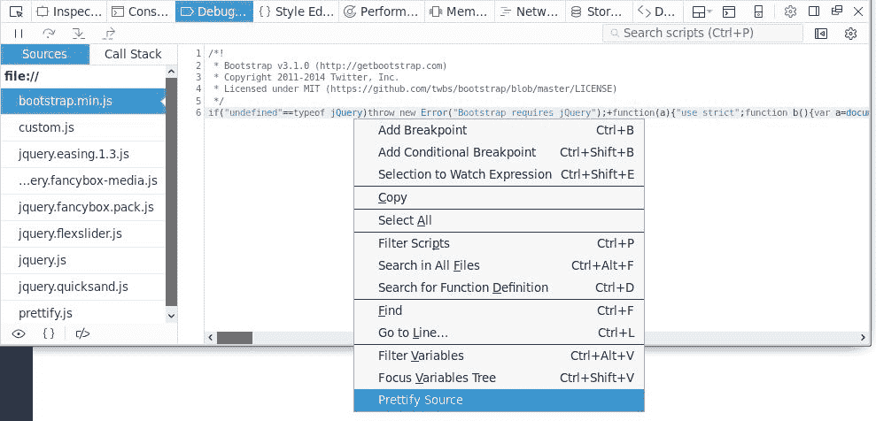

# 控制台面板

控制台面板显示由 HTML 元素和脚本代码执行触发的日志、错误和警告。它还包括一个 JavaScript 命令行解释器，可在窗口底部可见。它允许您在当前网站的上下文中执行 JavaScript 代码：

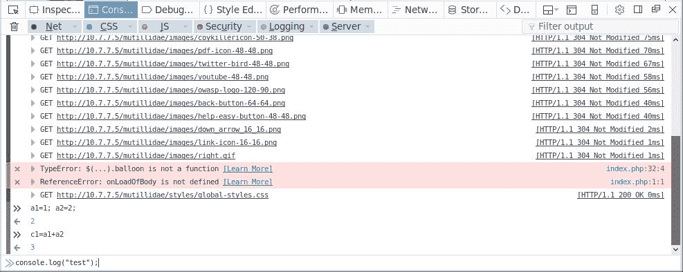

# 网络面板

网络面板显示当前网页生成的所有网络流量。它可以让您看到页面正在与哪里通信以及它正在进行哪些请求。它还包括对每个请求的响应和加载所需时间的可视化表示：

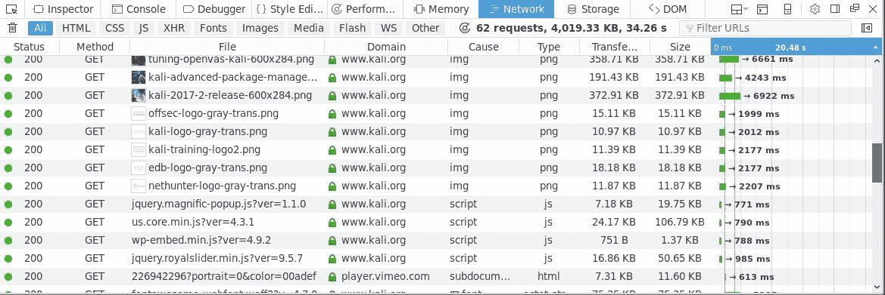

如果选择任何请求，您将看到头部和正文的详细信息，以及响应和 cookie：

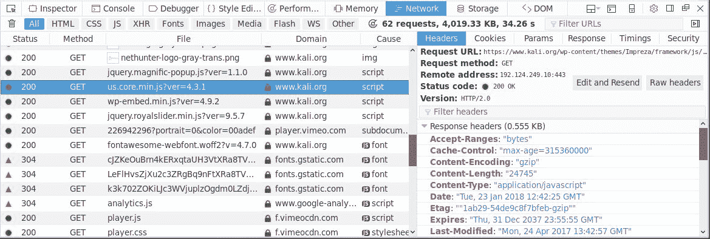

# 存储面板

存储面板也是最近添加的，用于允许与 HTML5 存储选项和 cookie 进行交互。在这里，您可以浏览和编辑 cookie、Web 存储、索引数据库和缓存存储：

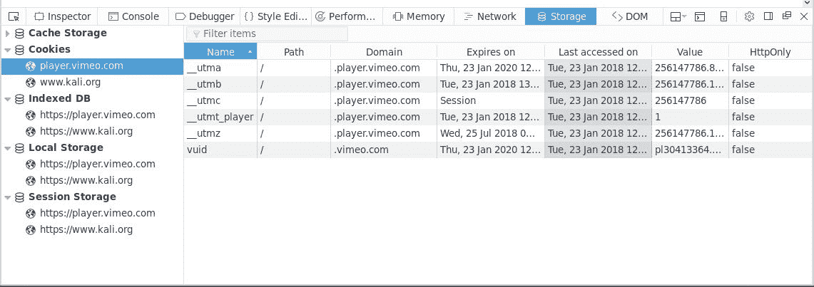

# DOM 面板

DOM 面板允许您查看和更改当前页面上所有 DOM 元素的值：

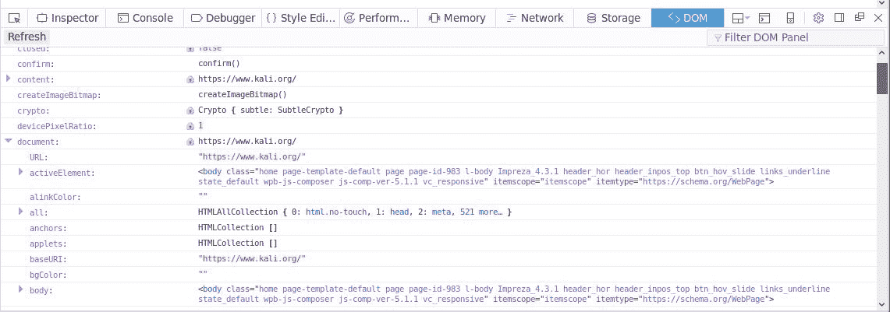

# HTML5 用于渗透测试

HTML 标准的最新版本带来了许多新功能，这些功能可能有助于开发人员防止其应用程序的安全缺陷和攻击。然而，它也给新功能的设计和实现带来了新的挑战，这可能导致应用程序由于使用尚未完全理解的新技术而向攻击者开放新的和意想不到的机会。

总的来说，渗透测试 HTML5 应用程序与测试任何其他 Web 应用程序没有区别。在本节中，我们将介绍 HTML5 的一些关键特性，它们对渗透测试的影响，以及实现这些特性的应用程序可能受到攻击的一些方式。

# 新的 XSS 向量

**跨站脚本**（**XSS**）是 HTML5 应用程序中的一个重大问题，因为 JavaScript 用于与从客户端存储到 WebSockets 到 Web Messaging 的所有新功能进行交互。

此外，HTML 包括可以用作 XSS 攻击向量的新元素和标签。

# 新元素

视频和音频是可以使用`<video>`和`<audio>`标签放入网页的新元素，这些标签也可以与`onerror`属性一起在 XSS 攻击中使用，就像``一样：

```
<video> <source onerror="javascript:alert(1)"> 
<video onerror="javascript:alert(1)"><source> 
<audio onerror="javascript:alert(1)"><source> 
```

# 新属性

表单元素具有可以用于执行 JavaScript 代码的新属性：

```
<input autofocus onfocus=alert("XSS")> 
```

`autofocus`属性指定在页面加载时`<input>`元素应自动获得焦点，`onfocus`设置当`<input>`元素获得焦点时的事件处理程序。结合这两个操作可以确保在页面加载时执行脚本：

```
<button form=form1 onformchange=alert("XSS")>X 
```

当对具有`form1` ID 的表单进行更改（值修改）时，将触发一个事件。该事件的处理程序是`XSS`负载：

```
<form><button formaction="javascript:alert(1)"> 
```

表单的 action 指示表单数据将被发送到的位置。在这个例子中，当按钮被按下时，它将 action 设置为一个 XSS 负载。

# 本地存储和客户端数据库

在 HTML5 之前，允许 Web 应用程序在客户端存储信息的唯一机制是 cookie。还有一些解决方法，如 Java 和 Adobe Flash，但它们带来了许多安全问题。HTML5 现在具有在客户端存储结构化和非结构化持久数据的能力，其中包括两个新功能：Web 存储和 IndexedDB。

作为渗透测试人员，您需要注意应用程序对客户端存储的任何使用。如果存储的信息是敏感的，请确保它得到适当的保护和加密。还要测试存储的信息是否在应用程序中进一步使用，并且是否可以篡改以生成 XSS 场景。最后，请确保此类信息在输入时得到正确验证，并在输出时进行清理。

# Web Storage

**Web Storage**是 HTML5 允许应用程序在客户端存储非结构化信息的方式，除了 cookie 之外。Web Storage 可以是两种类型：`localStorage`（没有过期时间）和`sessionStorage`（会在会话结束时删除）。Web Storage 由 JavaScript 对象`window.localStorage`和`window.sessionStorage`管理。

下面的屏幕截图显示了如何使用浏览器的开发者工具查看 Web Storage，本例中的类型为`localStorage`。如屏幕截图所示，信息使用键值对存储：

！[](img/00242.jpeg)

# IndexedDB

对于结构化存储（以表为单位组织的信息），HTML5 提供了**IndexedDB**。

在 IndexedDB 之前，Web SQL Database 也被用作 HTML5 的一部分，但在 2010 年被弃用。

下面的屏幕截图显示了一个由 Web 应用程序存储的索引数据库的示例，可以使用浏览器的开发者工具查看：

！[](img/00243.jpeg)

# Web Messaging

**Web Messaging**允许两个不需要 DOM 的文档之间进行通信，并且可以跨域使用（有时称为**跨域消息传递**）。要接收消息，应用程序需要设置一个事件处理程序来处理传入的消息。接收消息时触发的事件具有以下属性：

+   `data`：消息数据

+   `origin`：发送者的域名和端口

+   `lastEventId`：当前消息事件的唯一 ID

+   `source`：包含引发消息的文档窗口的引用

+   `ports`：这是一个包含与消息一起发送的任何`MessagePort`对象的数组

```
origin value is not checked. This means that any remote server will be able to send messages to that application. This constitutes a security issue, as an attacker can set up a server that sends messages to the application:
```

```
var messageEventHandler = function(event){ 
    alert(event.data); 
} 
```

下面的示例显示了一个事件处理程序，它进行了正确的来源验证：

```
window.addEventListener('message', messageEventHandler,false); 
var messageEventHandler = function(event){ 
    if (event.origin == 'https://trusted.domain.com') 
    { 
        alert(event.data); 
    } 
} 
window.addEventListener('message', messageEventHandler,false); 
```

# WebSockets

HTML5 中最激进的新增功能可能是引入了**WebSockets**，它是客户端和服务器之间基于 HTTP 协议的持久双向通信，HTTP 协议是无状态的协议。

如第一章所述，*渗透测试和 Web 应用程序简介*，WebSockets 通信始于客户端和服务器之间的握手。在下面的屏幕截图中，取自 Damn Vulnerable Web Sockets（[`github.com/snoopysecurity/dvws`](https://github.com/snoopysecurity/dvws)），您可以看到 WebSockets 的基本 JavaScript 实现：

！[](img/00244.jpeg)

此代码在 HTML 文档加载后立即启动 WebSockets 连接。然后设置连接建立时、消息到达时以及连接关闭或发生错误时的事件处理程序。当页面加载请求以启动连接时，它看起来像这样：

！[](img/00245.jpeg)

当连接被接受时，服务器将作出以下响应：

！[](img/00246.jpeg)

请注意，请求中的`Sec-WebSocket-Key`和响应中的`Sec-WebSocket-Accept`仅用于握手和启动连接。它们不是身份验证或授权控制。这是渗透测试人员必须注意的事项。WebSockets 本身不提供任何身份验证或授权控制；这需要在应用程序级别完成。

此外，前面示例中实现的连接没有加密。这意味着它可以通过中间人攻击进行嗅探和/或拦截。下一个截图显示了使用 Wireshark 捕获的流量，显示了客户端和服务器之间的交换：


前两个数据包是 WebSockets 握手。之后，消息交换开始。在这种情况下，客户端发送一个名称，服务器回复`Hello <NAME> :) How are you?`。按照协议定义（RFC 6455，[`www.rfc-base.org/txt/rfc-6455.txt`](http://www.rfc-base.org/txt/rfc-6455.txt)），从客户端发送到服务器的数据应该被掩码处理，如果接收到非掩码消息，服务器必须关闭连接。相反，从服务器发送到客户端的消息不会被掩码处理，如果接收到掩码数据，客户端将关闭连接。掩码处理不应被视为安全措施，因为掩码密钥包含在数据包帧中。

# 拦截和修改 WebSockets

Burp Suite 和 OWASP ZAP 等 Web 代理可以记录 WebSockets 通信。它们还能够拦截并允许添加传入和传出的消息。OWASP ZAP 还允许重新发送消息并使用 Fuzzer 工具来识别漏洞。

在 Burp Suite 的代理中，有一个选项卡显示了 WebSockets 通信的历史记录。代理中的常规拦截选项可用于拦截和修改传入和传出的消息。它不包括使用 Repeater 重新发送消息的功能。下一个截图显示了在 Burp Suite 中拦截的消息：

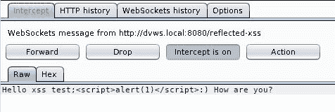

OWASP ZAP 还有一个专门的 WebSockets 历史选项卡。在该选项卡中，可以通过右键单击任何消息并选择 Break...来设置断点（类似于 Burp Suite 的 Intercept）。将弹出一个新对话框，可以设置断点参数和条件，如下图所示：

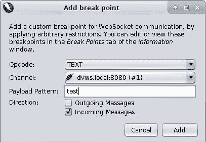

在右键单击消息时，还有一个 Resend 选项，它可以打开所选消息以进行修改和重新发送。这适用于传入和传出的流量。因此，当重新发送传出消息时，OWASP ZAP 将将消息传递给浏览器。下一个截图显示了重新发送对话框：

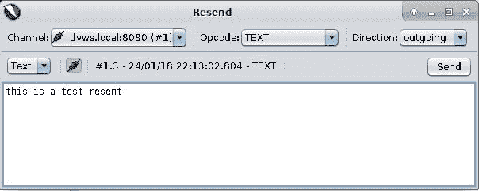

如果在 Resend 中右键单击文本，会出现一个选项，可以对该消息进行模糊处理。

下一个截图显示了如何向默认位置添加模糊字符串。在这里，我们只添加了一小组 XSS 测试：


当我们运行 Fuzzer 时，相应的选项卡会打开，并显示成功的结果（即，得到类似易受攻击应用程序的响应的结果）：


# HTML5 的其他相关功能

如前所述，HTML5 在不同领域中引入了许多功能，可能会影响应用程序的安全性。在本节中，我们将简要介绍 HTML5 提供的其他功能，这些功能也可能对我们寻找安全漏洞的方式和位置产生影响。

# 跨域资源共享（CORS）

当服务器启用时，请求中会发送头部`Access-Control-Allow-Origin`。该头部告诉客户端，服务器允许来自托管应用程序的源（域名和端口）以外的源的 XMLHttpRequest 请求。拥有以下头部允许来自任何源的请求，使得攻击者可以使用 JavaScript 绕过 CSRF 保护：

```
Access-Control-Allow-Origin: *  
```

# 地理位置

现代 Web 浏览器可以从安装了它们的设备中获取地理位置数据，无论是计算机中的 Wi-Fi 网络还是手机中的 GPS 和蜂窝信息。使用 HTML5 并且易受 XSS 攻击的应用程序可能会暴露其用户的位置数据。

# Web Workers

**Web Workers**是在后台运行的 JavaScript 代码，无法访问调用它们的页面的 DOM。除了能够在客户端运行本地任务外，它们还可以使用 XMLHttpRequest 对象执行域内和 CORS 请求。

如今，越来越多的 Web 应用程序使用 JavaScript 代码来利用客户端的处理能力来挖掘加密货币。大多数情况下，这是因为这些应用程序已经被入侵。如果应用程序容易受到 XSS 攻击，Web Workers 为攻击者提供了独特的机会，特别是如果它使用用户输入来向 Web Workers 发送消息或创建它们。

AppSec Labs 创建了一个工具包，*HTML5 Attack Framework* ([`appsec-labs.com/html5/`](https://appsec-labs.com/html5/))，用于测试 HTML5 应用程序的特定功能，例如以下功能：

+   点击劫持

+   CORS

+   HTML5 DoS

+   Web 消息传递

+   存储转储器

# 绕过客户端控制

随着现代 Web 应用程序在客户端的能力，开发人员有时更容易将检查和控制委托给由浏览器执行的客户端代码，从而使服务器免于额外的处理。起初，这可能看起来是个好主意；也就是说，让客户端处理所有数据呈现、用户输入验证、格式化，并仅使用服务器处理业务逻辑。然而，当客户端是一个 Web 浏览器时，它是一个多功能工具，不仅仅用于一个应用程序，并且可以使用代理来隧道化所有通信，然后可以被用户篡改和控制，开发人员需要在服务器端加强所有与安全相关的任务，如身份验证、授权、验证和完整性检查。作为渗透测试人员，您会发现很多应用程序在这方面做得不够一致。

一个非常常见的情况是应用程序根据用户的配置文件和权限级别显示或隐藏 GUI 元素和/或数据。很多时候，所有这些元素和数据已经从服务器检索到，并且只是使用 HTML 代码中的样式属性禁用或隐藏。攻击者或渗透测试人员可以使用浏览器的开发者工具中的检查器选项更改这些属性并访问隐藏的元素。

让我们通过*Mutillidae II 的客户端控制挑战*（其他 | 客户端“安全”控制）来回顾一个例子。这是一个具有许多不同类型的输入字段的表单，其中一些被禁用、隐藏或在您想要写入它们时移动。如果您只填写其中一些字段并点击提交，您将收到一个错误。您需要填写所有字段：


按下*F12*键打开开发者工具，或右键点击其中一个禁用的字段并选择检查元素。后者也会打开开发者工具，但它还会将您定位到检查器中的特定区域，并且是您选择的元素所在的区域：

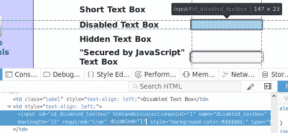

例如，您可以看到禁用的文本框具有一个属性`disabled`，其值为`1`。有人可能认为将值更改为`0`应该启用它，但事实并非如此。任何值都会使浏览器将输入显示为禁用状态。因此，双击属性名称并将其删除。现在您可以向其添加文本：

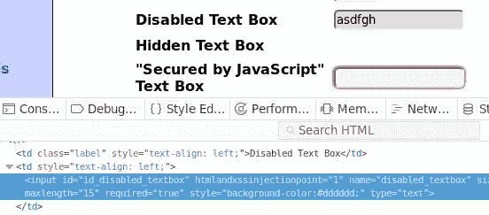

您可以继续更改所有字段的属性，以便填写它们。您还会找到一个密码字段。如果您检查它，您会发现即使页面上只显示点，它实际上包含明文值，在实际应用程序中可能是一个实际的密码：


最后，当您填写完所有字段并再次点击提交时，会弹出一个警告，提示某些字段格式不正确：


可以通过进入开发者工具中的调试器面板，并在搜索框中输入感叹号`!`来搜索所有文件中的部分文本，从而追踪此消息。`index.php`中的函数执行验证操作：

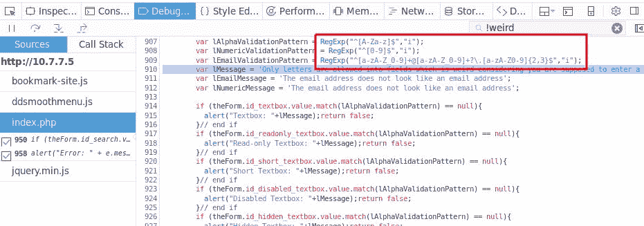

请注意，此函数使用正则表达式验证输入，并且这些正则表达式被形成为仅匹配一个字符字符串。在这里，您可以做两件事：您可以在定义正则表达式之后设置断点并在运行时更改其值，和/或者您可以使用与这些检查匹配的值填充所有字段，以便可以发送请求，然后使用代理拦截请求并在代理中进行编辑。现在我们将进行后者：

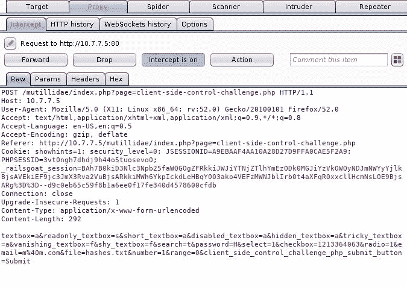

您可以在任何字段中输入任何值。如果您认为这与您的测试相关，请甚至可以添加或删除字段。

因此，使用浏览器的开发者工具，您可以轻松启用、禁用、显示或隐藏网页中的任何元素。它还可以让您监视、分析和控制 JavaScript 代码的执行流程。即使存在一个耗时低效的复杂验证过程，您也可以调整输入并在请求离开浏览器后使用代理进行修改。

# 缓解 AJAX、HTML5 和客户端漏洞

防止客户端漏洞的关键，或者至少是最小化其影响的关键，是*永远不要相信外部信息*，无论是来自客户端应用程序、Web 服务还是服务器输入。在处理之前，这些信息必须始终进行验证，并且在以任何格式（如 HTML、CSV、JSON 和 XML）显示给用户之前，所有显示给用户的数据必须经过适当的清理和格式化。在客户端进行验证是一个好的实践，但不能替代服务器端验证。

身份验证和授权检查也是如此。可以采取一些措施来减少到达服务器的无效请求的数量，但服务器端代码必须验证到达的请求确实是有效的，并且被允许继续到发送此类请求的用户会话。

对于 AJAX 和 HTML5，正确配置服务器和参数，如跨域、内容类型头和 Cookie 标志，将有助于防止许多攻击造成损害。

# 总结

在本章中，您了解了如何爬取 AJAX 应用程序。然后，我们继续审查 HTML5 对渗透测试人员的影响，包括新功能和新的攻击向量。然后，我们回顾了一些绕过客户端实施的安全控制的技术。在最后一节中，我们回顾了一些需要考虑的关键问题，以防止 AJAX、HTML5 和客户端漏洞。

在下一章中，您将了解更多关于 Web 应用程序中的日常安全漏洞。
