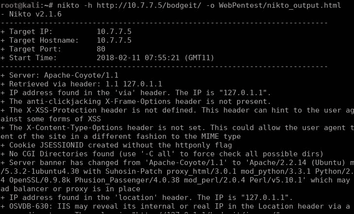
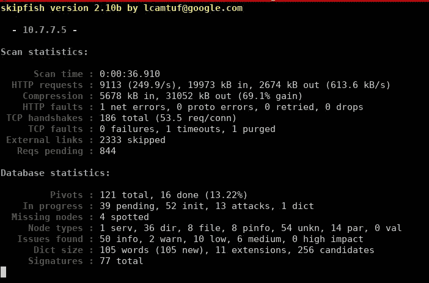
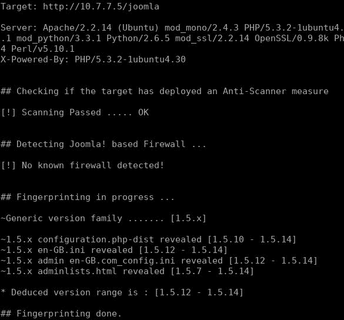
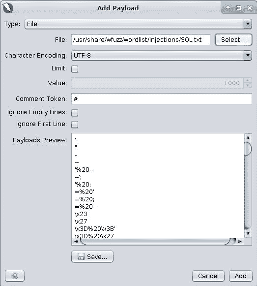
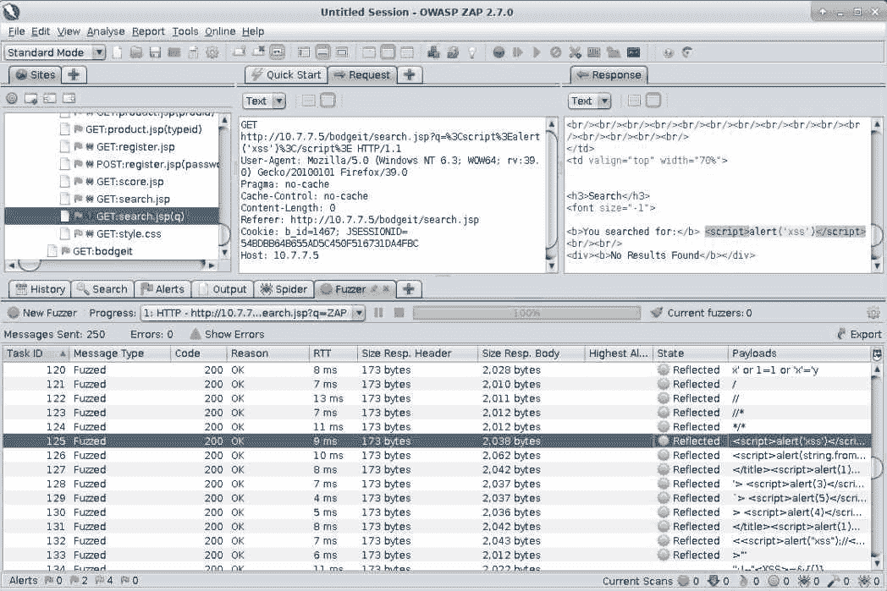
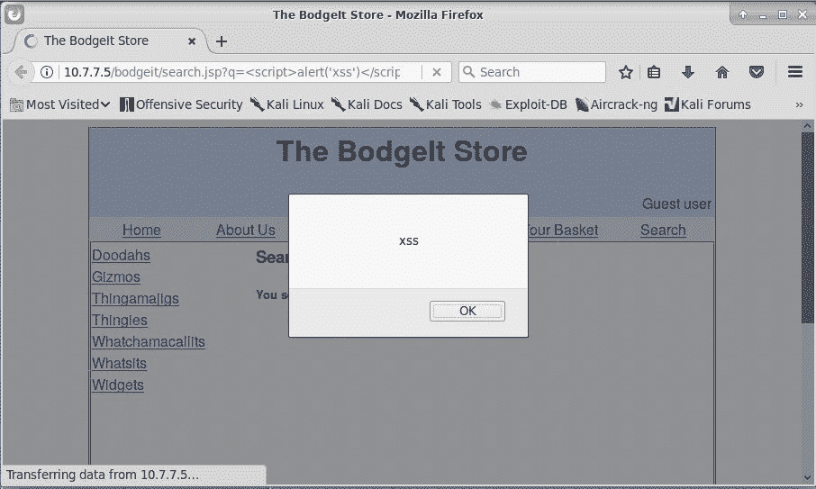
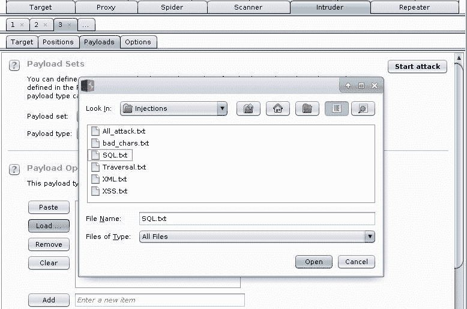
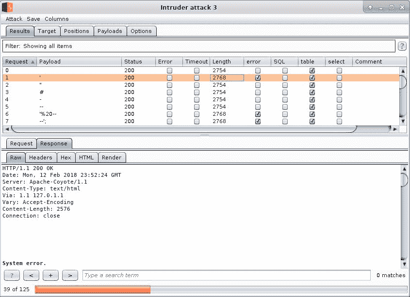
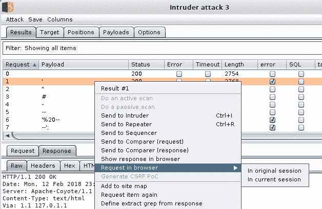

# 在 Web 应用程序上使用自动化扫描器

到目前为止，您已经学习了如何通过逐个测试参数或请求来查找和利用 Web 应用程序中的漏洞。尽管这是发现安全漏洞的最佳方法，特别是与应用程序内部信息流相关的漏洞或与业务逻辑和授权控制相关的漏洞，但在专业渗透测试中，有些项目由于时间、范围或数量的原因无法通过手动测试完全解决，需要使用帮助加速发现漏洞过程的自动化工具。

在本章中，我们将讨论在 Web 应用程序上使用自动化漏洞扫描器时需要考虑的方面。您还将了解 Kali Linux 中包含的扫描器和模糊测试工具以及如何使用它们。

# 在使用自动化扫描工具之前的考虑事项

Web 应用程序漏洞扫描器的操作方式与其他类型的扫描器（如 OpenVAS 或 Nessus）略有不同。后者通常连接到主机上的端口，获取运行在这些端口上的服务的类型和版本，然后将此信息与其漏洞数据库进行比对。相反，Web 应用程序扫描器会识别应用程序页面中的输入参数，并在每个参数上提交大量请求，探测不同的有效负载。

由于以这种方式操作，自动化扫描几乎肯定会在数据库中记录信息，生成活动日志，修改现有信息，并且如果应用程序具有删除或恢复功能，甚至可能擦除数据库。

以下是渗透测试人员在将 Web 漏洞扫描器作为测试手段之前必须考虑的关键因素：

+   检查范围和项目文档，确保允许使用自动化工具。

+   在专门为此目的设置的环境中进行测试（QA、开发或测试）。仅在客户明确要求的情况下使用生产环境，并让他们知道存在损坏数据的固有风险。

+   更新工具的插件和模块，以使结果与最新的漏洞披露和技术保持同步。

+   在启动扫描之前检查扫描工具的参数和范围。

+   将工具配置到最高级别的日志记录。日志将在任何事件发生时非常有用，以及用于验证结果和报告。

+   不要让扫描器无人看管。您不需要盯着进度条，但应不断检查扫描器的运行情况和被测试服务器的状态。

+   不要依赖单一工具-有时不同的工具会对相同类型的测试产生不同的结果。当一个工具错过了一些漏洞时，另一个工具可能会找到它，但会错过其他东西。因此，如果您在测试范围内使用自动化扫描工具，请使用多个工具，并考虑使用商业产品，如 Burp Suite Professional 或 Acunetix。

# Kali Linux 中的 Web 应用漏洞扫描器

Kali Linux 包括多个用于自动化扫描 Web 应用程序漏洞的工具。我们已经检查了其中一些，特别是那些专注于特定漏洞的工具，如用于 SQL 注入的 sqlmap 或用于跨站脚本（XSS）的 XSSer。

接下来，我们将介绍这里列出的一些更通用的 Web 漏洞扫描器的基本用法：

+   Nikto

+   Skipfish

+   Wapiti

+   OWASP-ZAP

# Nikto

长期以来的经典之作，**Nikto**可能是世界上使用最广泛、最知名的网络漏洞扫描器。尽管它的扫描操作不是很深入，其发现结果有些通用（主要与过时的软件版本、使用的易受攻击的组件或通过分析响应头检测到的配置错误有关），但 Nikto 仍然是一个非常有用的工具，因为它拥有广泛的测试集和低破坏性的特点。

Nikto 是一个命令行工具。在下面的截图中，使用`nikto`命令和参数`-h`指定要扫描的主机或 URL，`-o`指定输出文件。文件的扩展名确定报告的格式。其他常见的格式有`.csv`（逗号分隔文件）和`.txt`（文本文件）：

有关使用`nikto`的更多详细信息和其他选项，请使用`-H`选项运行它以获取完整的帮助。



现在让我们看看上次扫描的报告是什么样子的：


根据这两个屏幕截图，您可以看到 Nikto 识别出了服务器版本和响应头中的一些问题。特别是，一个 IP 地址泄露了一些保护头的缺失，比如`X-Frame-Options`和`X-XSS-Protection`，以及会话 cookie 不包含`HttpOnly`标志。这意味着它可以通过脚本代码检索到。

# Skipfish

**Skipfish**是一个非常快速的扫描器，可以帮助识别以下漏洞：

+   跨站脚本攻击

+   SQL 注入

+   命令注入

+   XML/XPath 注入

+   目录遍历和文件包含

+   目录列表

根据其 Google *Code*页面（[`code.google.com/p/skipfish/`](http://code.google.com/p/skipfish/)）：

Skipfish 是一款主动的网络应用安全侦察工具。它通过递归爬行和基于字典的探测来为目标站点准备一个交互式站点地图。然后，该地图会被一些主动的（但希望不会造成破坏的）安全检查的输出进行注释。该工具生成的最终报告旨在作为专业网络应用安全评估的基础。

使用 Skipfish 非常简单。您只需要提供要扫描的 URL 作为参数。可选地，您可以添加输出文件并对扫描进行微调。要在测试虚拟机中运行 Skipfish 并生成 HTML 报告，请使用以下命令：

```
skipfish -o WebPentest/skipfish_result -I WackoPicko http://10.7.7.5/WackoPicko/  
```

`-o`选项指示报告存储的目录。`-I`选项告诉 Skipfish 只扫描包含字符串`WackoPicko`的 URL，排除虚拟机中的其他应用程序。最后一个参数是您希望扫描开始的 URL。

当启动命令时，会出现一个信息屏幕。您可以按任意键或等待 60 秒开始扫描。一旦扫描开始，将显示以下状态屏幕：



当扫描完成时，会显示如下的摘要屏幕：


此外，一旦扫描完成，报告将准备好在指定的文件夹中。以下截图显示了 Skipfish 报告的样子：


报告显示了 Skipfish 在高风险（红点）到低风险（橙点）的顺序中识别出的漏洞。例如，Skipfish 在登录页面中识别出了一个 SQL 注入漏洞，查询注入向量，被扫描器评为高风险。它还识别出了一个目录遍历或文件包含和一个可能的 XSS 漏洞，被评为中风险，等等。

# Wapiti

**Wapiti**是一个活跃维护的基于命令行的网络漏洞扫描工具。Wapiti 3.0 版本于 2018 年 1 月发布（[`wapiti.sourceforge.net/`](http://wapiti.sourceforge.net/)）；然而，Kali Linux 仍然包含先前版本（2.3.0）。根据 Wapiti 网站的介绍，该工具包括检测以下漏洞的模块：

+   文件泄露（本地和远程包含/引用，`fopen`，`readfile`...）

+   数据库注入（PHP/JSP/ASP SQL 注入和 XPath 注入）

+   XSS（跨站脚本）注入（反射和永久）

+   命令执行检测（`eval()`，`system()`，`passtru()`...）

+   CRLF 注入（HTTP 响应拆分，会话固定...）

+   XXE（XML 外部实体）注入

+   使用已知的潜在危险文件（感谢 Nikto 数据库）

+   可以绕过的弱`.htaccess`配置

+   存在备份文件，提供敏感信息（源代码泄露）

+   Shellshock（又名 Bash 漏洞）

要启动 Wapiti，您需要在命令行中输入`launch`命令，然后输入要扫描的 URL 和选项。

在下面的屏幕截图中，Wapiti 在易受攻击的虚拟机上通过 HTTPS 站点运行，生成报告存储在`wapiti_output`目录中（使用`-o`选项）。您可以跳过 SSL 证书验证，因为测试虚拟机具有自签名证书。如果不进行此类验证，Wapiti 将停止扫描，因此使用`--verify-ssl 0`来绕过验证。您不应发送超过 50 个相同请求的变体（使用`-n`选项）。这样做是为了防止循环。最后，使用`2> null`来防止标准错误输出过多，因为扫描器将发送多个具有非预期值的请求，而 Wapiti 可能会非常冗长：

```
wapiti https://10.7.7.5/bodgeit/ -o wapiti_output --verify-ssl 0 -n 20 2>null 
```

然后您将在屏幕上看到以下输出：

！[](img/00280.jpeg)

扫描需要一些时间。完成后，打开指定目录中的`index.html`文件以查看结果。以下是 Wapiti 报告漏洞的示例：

！[](img/00281.jpeg)

Wapiti 的报告非常详细，包括每个发现的描述，用于触发潜在漏洞的请求，建议的解决方案以及获取有关这些信息的参考资料。在前面的屏幕截图中，您可以看到它在 BodgeIt 的搜索页面中发现了 XSS 漏洞。

# OWASP-ZAP 扫描器

在 OWASP-ZAP 的众多功能中，有一个主动漏洞扫描器。在这种情况下，“主动”意味着扫描器会主动向服务器发送精心设计的请求，而不是被动扫描器，后者仅通过代理分析 Web 服务器发送的请求和响应，而正常浏览应用程序。

要使用扫描器，您需要右键单击要扫描的站点或目录，然后选择攻击 | 主动扫描...：

！[](img/00282.jpeg)

主动扫描器不会对所选目标进行任何爬行或蜘蛛行为。因此，建议您在设置代理的同时手动浏览目标站点，或在扫描目录或主机之前运行蜘蛛。

在主动扫描对话框中，您可以选择目标，是否要进行递归扫描，以及如果启用高级选项，可以选择扫描策略、攻击向量、目标技术和其他选项：

！[](img/00283.jpeg)

单击“开始扫描”后，主动扫描选项卡将获得焦点，并且扫描进度和请求日志将显示在其中：

！[](img/00284.jpeg)

扫描结果将记录在警报选项卡中：

！[](img/00285.jpeg)

此外，使用主菜单中的报告，您可以将结果导出为 HTML、XML、Markdown 或 JSON 等多种格式。以下屏幕截图显示了 HTML 报告的外观：

！[](img/00286.jpeg)

OWASP-ZAP 还按风险级别对其扫描结果进行排序，并包括对发现的问题的详细描述、使用的有效负载、解决方案建议和参考资料。

Burp Suite 在其专业版中也有一个主动扫描器，可以提供非常准确的结果，并且误报率很低。

# 内容管理系统扫描器

**内容管理系统**（**CMS**），如 WordPress、Joomla 或 Drupal，是用于创建网站的框架，几乎不需要编程。它们集成了第三方插件，以简化诸如登录和会话管理、搜索甚至包括完整购物车模块等任务。

因此，CMS 不仅在其自身的代码中容易受到攻击，而且在其包含的插件中也容易受到攻击。后者不受一致的质量控制，并且通常由独立程序员在业余时间制作，根据自己的时间表发布更新和补丁。

因此，我们现在将介绍一些最受欢迎的 CMS 漏洞扫描工具。

# WPScan

**WPScan**正如其名称所示，是一个专注于 WordPress CMS 的漏洞扫描工具。它将识别 WordPress 的版本号和已安装插件的版本号，然后将它们与已知漏洞的数据库进行匹配，以确定可能的安全风险。

下图显示了 WPScan 的基本用法，只需将目标 URL 作为参数添加即可：


首次运行时，您可能需要使用`--update`选项更新数据库。

# JoomScan

**JoomScan**是包含在 Kali Linux 中的用于 Joomla 网站的漏洞扫描工具。要使用它，只需添加`-u`选项，后跟站点的 URL，如下所示：

```
joomscan -u http://10.7.7.5/joomla  
```

JoomScan 首先尝试通过检测 Joomla 版本和插件来识别服务器，如下图所示：



之后，JoomScan 将显示与检测到的配置或已安装插件相关的漏洞：


# CMSmap

**CMSmap**未包含在 Kali Linux 中，但可以从其 Git 存储库轻松安装，如下所示：

```
git clone https://github.com/Dionach/CMSmap.git 
```

CMSmap 用于扫描 WordPress、Joomla 或 Drupal 网站的漏洞。它具有自动检测站点使用的 CMS 的能力。它是一个命令行工具，您需要使用`-t`选项指定目标站点。CMSmap 显示它找到的漏洞，并在前面加上一个指示严重程度的标识：`[I]`表示信息，`[L]`表示低，`[M]`表示中，`[H]`表示高，如下图所示：


在截图中使用的`--noedb`选项可以防止 WordPress 在 Exploit Database（[`www.exploit-db.com/`](https://www.exploit-db.com/)）中寻找已识别漏洞的利用程序，因为我们的 Kali Linux 虚拟机未连接到互联网。尝试连接到外部服务器将导致错误和获取结果的延迟。

# 模糊测试 Web 应用程序

**模糊测试**是一种测试机制，通过常规输入将特制的（或随机的，取决于模糊测试的类型）数据发送到软件实现中。实现可以是 Web 应用程序、厚客户端或运行在服务器上的进程。它是一种黑盒测试技术，以自动化方式注入数据。尽管模糊测试主要用于安全测试，但也可用于功能测试。

从前面的定义中，人们可能认为模糊测试与任何漏洞扫描是相同的。是的，模糊测试是漏洞扫描过程的一部分，还可以涉及指纹识别和 Web 应用程序的爬行以及响应分析，以确定是否存在漏洞。

有时，我们需要将模糊测试从扫描过程中分离出来，单独执行，这样我们就可以决定测试输入并分析测试结果，而不是由扫描器来决定。这样，我们可以更好地控制将哪些参数中的测试值发送到服务器。

# 使用 OWASP-ZAP 模糊器

**OWASP-ZAP 模糊器**可以从站点地图、代理历史或请求面板中运行，只需右键单击要模糊的请求，然后选择 Attack | Fuzz...，如下图所示：


在执行此操作后，模糊测试对话框将出现，您可以在其中选择插入点；也就是说，您想要尝试不同值以分析服务器响应的请求的部分。在下面的示例中，我们选择了 OWASP BWA 易受攻击的虚拟机中 BodgeIt 的搜索中的`q`参数的值：


请注意，已经添加了两个有效负载列表。要做到这一点，选择要模糊测试的文本，本例中为`q`的值，并单击右侧的"添加..."（在模糊测试位置选项卡中）以显示有效负载对话框。然后在该对话框中单击"添加..."。您将从文件`/usr/share/wfuzz/wordlist/injections/SQL.txt`中获取第一个有效负载列表。

该文件包含将帮助识别 SQL 注入漏洞的模糊测试字符串。在有效负载类型中选择文件，单击"选择..."，然后浏览到要加载的文件，如下面的截图所示。然后单击"添加"将该列表添加到模糊测试器中：



接下来，使用第二个有效负载来测试 XSS。这次您将使用文件模糊测试器作为类型。这是 OWASP-ZAP 默认包含的一组模糊测试字符串。从这些模糊测试器中，从 JbroFuzz | XSS 中选择一些 XSS 列表：


OWASP-ZAP 中可用于模糊测试字符串的其他选项如下：

+   **空/空值**：此选项提交原始值（无更改）

+   **数字**：此选项生成一系列数字，允许您定义起始值、结束值和增量

+   **正则表达式**：此选项生成与给定正则表达式匹配的一定数量的字符串

+   **脚本**：此选项允许您使用脚本（从"工具" | "选项..." | "脚本"加载）生成有效负载

+   **字符串**：此选项显示手动提供的简单字符串列表

一旦选择了所有插入点及其相应的模糊测试输入，您可以通过点击"开始模糊测试"来启动模糊测试器。然后，模糊测试器选项卡将显示在底部面板中。

在下一个截图中，您可以看到模糊测试的结果。状态列显示了工具进行的初步诊断，指示此类请求导致可利用的漏洞的可能性有多大。请注意示例中的单词"Reflected"。这意味着模糊测试器发送的字符串已作为响应的一部分由服务器返回。我们知道这是 XSS 的字符串指示器：



为了进一步探索在模糊测试器选项卡中显示的结果中是否存在可利用的漏洞，您可以选择任何请求及其头部和正文。相应的响应将显示在中央面板中的相关部分。响应将突出显示*可疑*字符串。这样，您可以一眼看出是否存在漏洞，以及该特定测试用例是否值得进一步挖掘。如果是这种情况，您可以右键单击请求并选择"使用请求编辑器打开/重新发送"来启动请求编辑器并操作和重新发送请求。

进一步调查您认为可能导致利用的请求的另一个选项是在浏览器中重放该请求，以便您可以查看其行为和服务器的响应。要做到这一点，右键单击请求，选择"在浏览器中打开 URL"，然后选择您首选的浏览器。这将打开浏览器并使其提交所选的请求：



# Burp Intruder

您已经在前几章中使用了 Intruder 进行各种任务，并且您已经意识到它的强大和灵活性。现在我们将使用它来对 BodgeIt 登录页面进行模糊测试，以寻找 SQL 注入漏洞。您需要做的第一件事是将有效的登录请求从代理历史发送到 Intruder。这可以通过右键单击请求并选择"发送到 Intruder"来完成。

进入 Intruder 后，你将清除所有插入点，并在用户名值中添加一个插入点，如下图所示：


下一步是设置负载。为此，转到负载选项卡，点击“加载...”加载一个文件，并转到`/usr/share/wfuzz/wordlist/injections/SQL.txt`：



接下来，为了更容易识别有趣的请求，你将添加一些匹配规则，这样你就可以从攻击对话框中判断一个请求是否导致错误或包含有趣的词语。在选项中的 Grep - Match 部分添加以下术语：

+   `error`：当你想知道输入触发错误时，添加这个将很有用，因为基本的 SQL 注入在修改查询语法时会显示错误消息

+   `SQL`：如果错误消息不包含单词`error`，你希望在输入触发包含单词`SQL`的响应时得到通知

+   `table`：当你期望读取包含表名的 SQL 详细错误消息时添加

+   `select`：在有 SQL 语句泄露的情况下添加这个

上述术语列表绝不是用于响应匹配的最佳列表。它仅供演示目的。在实际情况中，人们会首先手动分析应用程序给出的实际响应，然后选择与上下文和所寻找的漏洞相匹配的术语。下面的截图显示了示例匹配列表的样子：


一旦所有攻击参数都配置好了，你就可以开始攻击了。`error`很快就开始匹配了。你可以看到每个响应都匹配了`table`，所以这不是一个好选择。至少在最初的响应中，`SQL`和`select`没有匹配。如果你选择一个已经勾选了`error`的响应，你会看到页面顶部有一个“系统错误”的消息，这似乎是在负载包含单引号时触发的。

这可能是 SQL 注入的一个指标，值得进一步挖掘一下：



为了查看如果从浏览器中执行此请求，它会在 Burp Suite 的任何组件的每个请求或响应中的行为，你可以右键单击并选择“在浏览器中请求”。你可以选择是否要使用原始会话（发送请求的会话 cookie）或当前会话（浏览器当前拥有的会话 cookie）：



当你将请求从 Burp Suite 发送到浏览器时，你会得到一个以`http://burp/repeat/`开头的 URL，你需要将其复制并粘贴到要重放请求的浏览器中。Burp Suite 不像 ZAP 那样启动浏览器：


下面的截图显示了示例中的请求在浏览器中的显示方式。它明显看起来不应该有“系统错误”的消息，你应该深入研究该请求，并手动尝试变体以获得 SQL 注入：


# 扫描后的操作

遗憾的是，提供渗透测试服务的公司往往只进行漏洞扫描，并在没有手动测试阶段的情况下定制和调整报告，而且没有验证扫描器发现的所谓漏洞是否真的存在。这不仅无法为客户提供任何价值，他们自己可以下载一个漏洞扫描器并对其应用程序进行扫描，而且还会损害公司对安全服务和安全公司的认知，使那些提供优质服务的人更难以以竞争性价格在市场上定位这些服务。

在扫描器生成扫描报告之后，您不能仅凭报告就说您发现了*X*和*Y*漏洞。因为扫描器总是会产生误报（即报告不存在的漏洞）和误报（例如扫描器错过的漏洞），所以您还必须进行手动测试，以便找到并报告自动化工具未覆盖的漏洞，例如授权问题、业务逻辑绕过或滥用等，以便验证扫描器报告的所有发现是否真正是漏洞。

# 总结

在本章中，我们讨论了在 Web 应用程序渗透测试中使用自动化漏洞扫描器的风险，以及在使用这些工具之前需要考虑的问题。

接下来，我们介绍了 Kali Linux 中包含的一些扫描器的使用，如 Nikto、Skipfish、Wapiti 和 OWASP-ZAP。我们还讨论了针对内容管理系统（如 WordPress、Joomla 和 Drupal）的专用扫描器。我们将模糊测试作为一种与扫描不同的技术进行了讨论。我们使用了 OWASP-ZAP 模糊测试器和 Burp Intruder 来测试单个输入上的多个输入。

最后，我们讨论了在自动化扫描或模糊测试完成后需要完成的一些任务。您需要验证扫描器的结果，以消除所有误报，并且需要手动测试应用程序，因为自动化扫描器无法找到某些漏洞。

通过本章，我们结束了本书。渗透测试是一个永远学习的领域。渗透测试人员需要跟上技术的步伐，尽管方法论在变化，但不应忘记旧的方法，因为如今的组织往往会使用过时的框架与先进的技术共存。

本书提供了对 Web 渗透测试的概述，方法论和技术的一般概述，以帮助您识别，利用和纠正 Web 应用程序中最常见的漏洞。您需要通过从不同的来源学习更多知识，进行研究，实践，然后再进行更多的实践来继续您的学习之旅。此外，了解其他领域，如开发，网络和操作系统，也是有利的，因为它可以让您将应用程序与其环境联系起来，并更好地评估其真正带来的风险。

除了本书提到的有价值的应用程序和其他可用的类似应用程序之外，公开的漏洞赏金计划，如 HackerOne（[`www.hackerone.com/`](https://www.hackerone.com/)）和 BugCrowd（[`www.bugcrowd.com/`](https://www.bugcrowd.com/)），是一个非常好的方式，让经验不足的测试人员通过测试真实应用程序来积累经验，并获得报酬。

我希望您，亲爱的读者，发现本书有趣且对您的目的有用，无论是为了了解 Web 应用程序安全以改进您的开发过程，还是为了追求渗透测试职业，或者作为一名经验丰富的渗透测试人员，以提高您的技能并扩展您的测试工具库。感谢您阅读本书。
